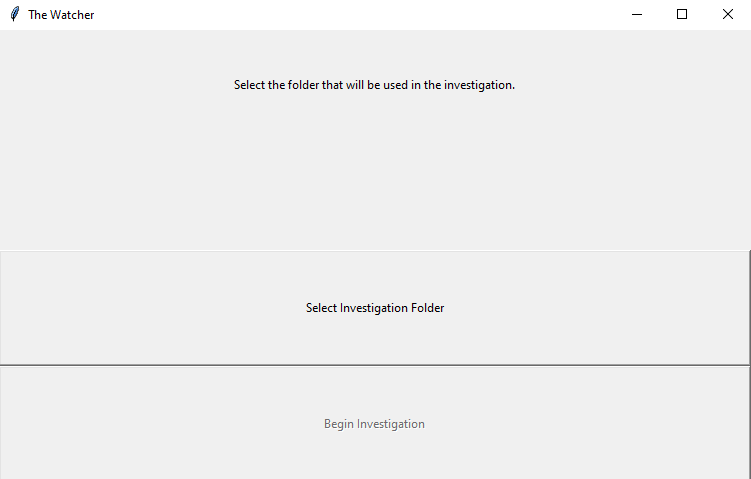
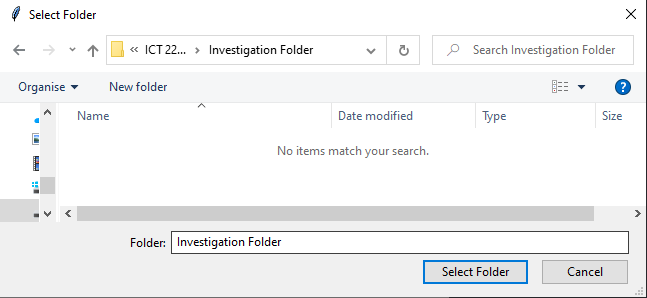
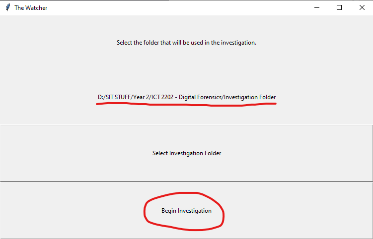
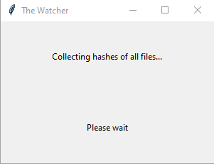

# The Watcher User Guide


## Table of Contents
  * [Installation](#installation)
  * [User Guide for The Watcher](#user-guide-for-the-watcher)
    + [Starting an investigation](#starting-an-investigation)
    + [Event Log](#event-log)
    + [File Log](#file-log)
    + [Ending the Investigation and Generate report](#ending-the-investigation-and-generate-report)

## Installation

The installation guide can be found [here](./README.md).

## User Guide for The Watcher
### Starting an investigation

To use The Watcher, run `main.py` in the `src` directory (Please run main.py from the src folder)

```
python main.py
```



Click on the "Select Investigation Folder" button, Navigate to the target folder and click on "Select Folder".



The path of the folder will be shown. Click on the "Begin Investigation".



Next, the program will start to collect the hashes of all the files in the directory. A new window would appear to indicate that the files are being hashed. This may take a while depending on the size of the directory and the number of files.



After that, the investigation will begin. Details such as the files investigated and time elapsed will be stated at the top of the GUI.


### Event Log

To view the Event Log, click on the "View Event Log" button as highlighted below. This will display all the file system events that have been captured by The Watcher.


### File Log

To view the File Log, click on the "View File Log" button as highlighted below. This will display all the files that are part of the investigation.


You can select the classification of the file by selecting the dropdown and selecting "Submissible" or "Non-Submissible"


You can also add/edit the notes for each file in the File Log by clicking on the "Edit" button beside the file.


You can view the changes made to the metadata of the file by clicking on the "View" button beside the file.

 

Finally, you can take a screenshot to be tagged with a file by clicking on the "Take" button beside the file. This will take a screenshot that can be viewed later when the report is generated.

### Ending the Investigation and Generate report

When you are finished investigating the folder, you may end the investigation by clicking on the "End Investigation" button highlighted below.


After ending the investigation, you will have to select the folder in which you would like to generate the report in. Click on the "Select Report Folder" to select the folder to save the report to.


Afterwards, the "Generate HTML report" button should become active. Click on it to generate the HTML report that will be stored in the folder specified.


